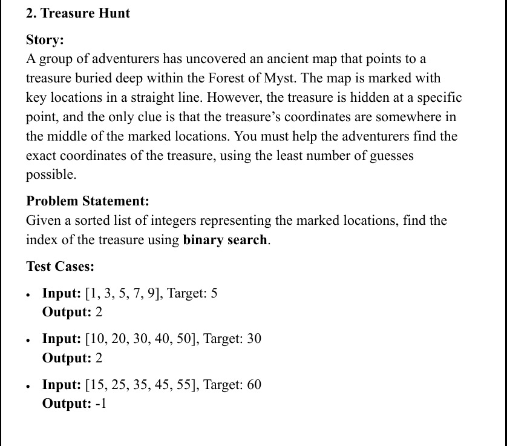

# 🗺️ Treasure Hunt – Search Algorithms

> Help a group of adventurers find the treasure hidden in the Forest of Myst using the **fewest guesses possible**.

An academic project for the **Algorithms** course (Level 2, Semester 2). Given a sorted list of marked locations, the program finds the index of the treasure with **Binary Search** and compares it against **Linear Search**.



---

## 📖 Problem

Given a sorted list of integers representing marked locations and a target value, return the **index** of the target, or **-1** if it does not exist.

| Input | Target | Output |
|---|---|---|
| `[1, 3, 5, 7, 9]` | `5` | `2` |
| `[10, 20, 30, 40, 50]` | `30` | `2` |
| `[15, 25, 35, 45, 55]` | `60` | `-1` |

## 🧠 Algorithms

| | Linear Search | Binary Search |
|---|---|---|
| Idea | Check every element in order | Halve the search range each step |
| Best case | O(1) | O(1) |
| Worst case | O(n) | O(log n) |
| Space | O(1) | O(1) (iterative) |
| Needs sorted input | No | **Yes** |

Binary search keeps `low` and `high` pointers, checks `mid = low + (high - low) / 2`, and discards the half that cannot contain the target. Computing `mid` this way avoids integer overflow.

## ✨ Features

- Linear Search and Binary Search with a **step-by-step trace** of every comparison
- **Compare Both** mode: result index, steps taken, execution time and the winner
- **Predefined test cases** from the problem statement
- Input validation, and automatic sorting when the entered array is not sorted
- Three front ends: console, Python GUI, and Windows Forms GUI

## 📁 Project Structure

```
Treasure-Hunt-Algorithms/
├── console-cpp/
│   └── TreasureHunt.cpp        # Console version (menu driven)
├── gui-cpp-cli/
│   ├── Main.cpp                # Entry point (C++/CLI)
│   └── TreasureHuntForm.h      # Windows Forms GUI + algorithms
├── gui-python/
│   └── TreasureHuntGUI.py      # Tkinter GUI
├── python/
│   └── treasure_hunt.py        # Minimal binary search solution
├── tests/
│   └── test_treasure_hunt.py   # pytest tests
├── docs/
│   ├── problem-statement.jpeg
│   └── implementation_plan.md
├── requirements.txt
└── README.md
```

## 🚀 How to Run

### 1. Console version (C++)

Works with any C++17 compiler. On **MSYS2 CLANG64**:

```bash
pacman -S mingw-w64-clang-x86_64-toolchain     # once
cd console-cpp
clang++ -std=c++17 -Wall TreasureHunt.cpp -o TreasureHunt.exe
./TreasureHunt.exe
```

Or with g++: `g++ -std=c++17 -Wall TreasureHunt.cpp -o TreasureHunt`

Menu: `l` Linear · `b` Binary · `c` Compare · `t` Test cases · `n` New array · `e` Exit

> The program calls the Windows `color` command for console colors. On Linux/macOS it prints a harmless `color: not found` message.

### 2. Python GUI (Tkinter)

Requires Python 3.8+ with Tkinter (included in the standard Windows installer).

```bash
cd gui-python
python TreasureHuntGUI.py
```

On MSYS2 CLANG64: `pacman -S mingw-w64-clang-x86_64-python mingw-w64-clang-x86_64-tk`

### 3. Windows Forms GUI (C++/CLI)

This version uses **C++/CLI** and **.NET Windows Forms**, so it builds **only with Visual Studio** (not with clang/MSYS2).

1. In the Visual Studio Installer, enable **Desktop development with C++** and **C++/CLI support for v143 build tools**.
2. Create a **CLR Empty Project (.NET Framework)**.
3. Add `Main.cpp` and `TreasureHuntForm.h` from `gui-cpp-cli/`.
4. Project Properties → Linker → System → SubSystem: **Windows (/SUBSYSTEM:WINDOWS)**.
5. Project Properties → Linker → Advanced → Entry Point: **main**.
6. Press **Ctrl+F5**.

### 4. Minimal Python solution + tests

```bash
python python/treasure_hunt.py
pip install -r requirements.txt
python -m pytest tests -v
```

## 🧪 Testing

`tests/test_treasure_hunt.py` covers the three problem-statement cases, plus empty list, single element, target below/above the range, first/last element and negative numbers. The console program's `t` option and the GUIs' **Run Test Cases** button run the same problem-statement cases.

## 🛠️ Tech Stack

C++17 · C++/CLI (.NET Windows Forms) · Python 3 · Tkinter · pytest

## 👩‍💻 Author

**Noura Maher Elamin** – Computer & Information Systems, Egyptian Chinese University

## 📄 License

Created for educational purposes as a university course project.
